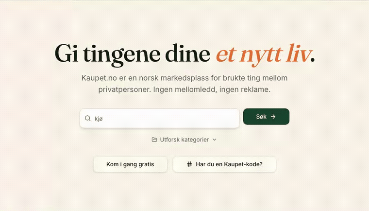

# Kaupet.no

[](LICENSE)
[](https://github.com/Kaupet-no/Kaupet/actions/workflows/ci.yml)

**Kaupet.no** en markedsplass for kjøp og salg av brukte ting, bygget på **åpen** og **fri** kode.



Dette repoet består av den produksjonssatte kildekoden, og du er velkommen til å laste ned, modifisere og distribuere det som del av en egen løsning om du ønsker det.

Det eneste kravet er at du respekterer vilkårene i lisensavtalen [GNU Affero General Public License v3.0](LICENSE), som betyr at all kode, også kode du selv modifiserer eller legger til, skal tilgjengeliggjøres åpent med de samme betingelsene.

#### Våre viktigste utviklingsprinsipper:

- Ingen sporing, ingen lukket plattform.
- Personvern skal være førende for alle designvalg.
- All kildekode skal forbli åpen og fri.
- Alle forbedringer skal komme fellesskapet til gode — ingen unntak.

## Slik kjører du prosjektet lokalt på din egen PC

Du trenger [Bun](https://bun.sh) installert.

```bash
git clone https://github.com/Kaupet-no/kaupet.git
cd kaupet
bun install
bun dev
```

Appen kjører deretter på `http://localhost:3000`.

### Miljøvariabler

Backenden (database, auth, filer) leveres av Supabase. Kopier `.env.example` til `.env` og fyll inn verdiene for ditt eget Supabase-prosjekt. Lokal kjøring mot egen Supabase-instans krever:

```
VITE_SUPABASE_URL=...
VITE_SUPABASE_PUBLISHABLE_KEY=...
VITE_SUPABASE_PROJECT_ID=...
```

## Teknologi

- [TanStack Start](https://tanstack.com/start) (React 19, SSR) + Vite 7
- [Tailwind CSS v4](https://tailwindcss.com)
- [shadcn/ui](https://ui.shadcn.com) komponenter
- [Supabase](https://supabase.com) — database, auth, storage
- [Cloudflare Workers](https://www.cloudflare.com/products/workers/) for hosting
- [Capacitor](https://capacitorjs.com) for native iOS og Android-app

## Bidra

Vi tar gjerne imot bidrag — store og små. Les [CONTRIBUTING.md](CONTRIBUTING.md) for hvordan du kommer i gang, og [CODE_OF_CONDUCT.md](CODE_OF_CONDUCT.md) for hvordan vi snakker sammen.

- Testing: `bun run test` kjører unittester. Se [docs/STAGING.md](docs/STAGING.md) for e2e-tester, RLS-tester og hvordan staging-miljøet fungerer.
- Endringer testes aldri direkte i produksjon — push til `staging`-branchen for å teste på **https://staging.kaupet.no**. Detaljer i [docs/STAGING.md](docs/STAGING.md).

Funnet en sårbarhet? Se [SECURITY.md](SECURITY.md) — ikke åpne en offentlig issue.

## Lisens

Kaupet.no og tilhørende kildekode er lisensiert under [GNU Affero General Public License v3.0](LICENSE). Se [NOTICE](NOTICE) for hva det betyr i praksis — særlig at om du gjør endringer eller videreutvikler kildekoden, må du dele all kode tilbake til fellesskapet under samme vilkår. Dette gjelder også for SaaS-tjenester.
