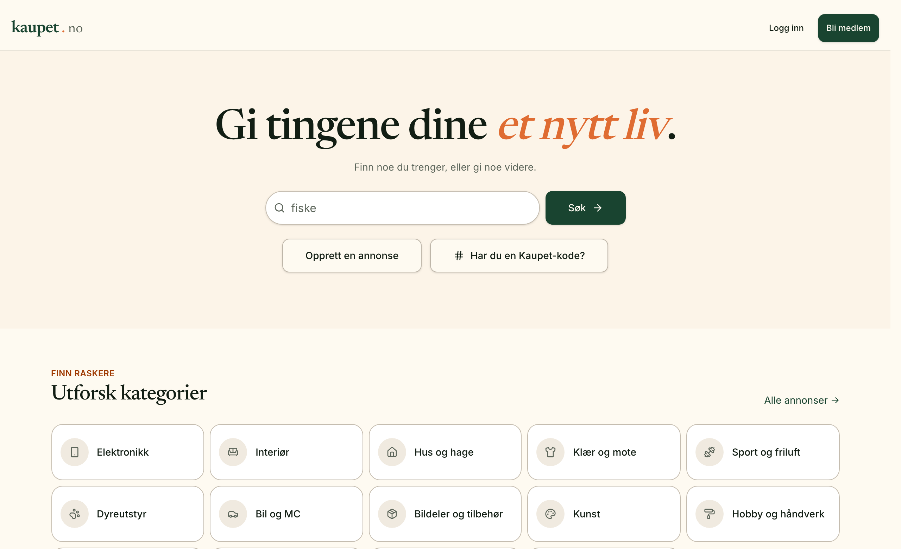
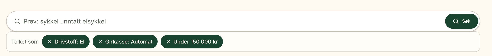
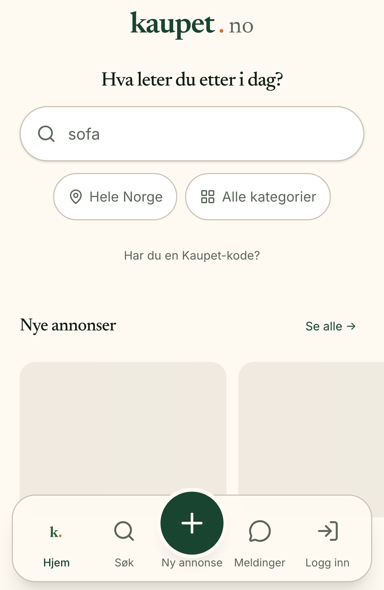

# Kaupet.no

[](LICENSE)
[](https://github.com/Kaupet-no/Kaupet/actions/workflows/ci.yml)
[](https://ko-fi.com/sprudlevann)



## Hva er Kaupet?

Kaupet er en bøyd form av det norrøne uttrykket _kaup_, som betyr _kjøp_ eller _avtale_. Det kan også spores til det latinske uttrykket _caupo_ for _kremmer_. **Kaupet.no** er bygget for å være en alternativ markedsplass der det skal være enkelt og gratis å omsette brukte gjenstander.

Kaupet.no finnes fordi en nasjonal markedsplass for brukte varer bør være grunnleggende infrastruktur i et moderne samfunn, og bør derfor være gratis å bruke, uten sporing eller salg av brukerdata. Opprettelse av annonser er en grunnleggende funksjon alle bør ha tilgang til, og skal aldri være en betalt tjeneste.

Digital infrastruktur og forvaltning av tjenesten er riktignok ikke gratis. Betaling skal derimot _alltid_ være frivillig, og skal gi merverdi utover tjenestens basisfunksjonalitet. Dette er en risiko **Kaupet.no** tar, og skal **aldri** gå på bekostning av tjenestens brukere.

## Funksjoner

- **Ingen sporing.** Ingen tredjeparts analyseverktøy, ingen sporende informasjonskapsler, ingen lagring av adferds- eller markedsføringsdata av brukerne.
- **Personvern først.** Ved å holde datainnsamlingen til et minimumsnivå, begrenser vi også hva som kan mistes, selges eller misbrukes av informasjon om brukerne. Se [personvernerklæringen](https://kaupet.no/personvern) og [behandlingsprotokollen](docs/PERSONVERN-BEHANDLINGSPROTOKOLL.md).
- **All kode er åpen.** Hele den produksjonssatte kildekoden ligger i dette repoet under [AGPL-3.0](LICENSE). Det betyr at du står fritt til å lese, kjøre lokale kopier, bygge dine egne tjenester eller distribuere egne kopier, så lenge endringene dine deles tilbake med samme vilkår.
- **Forbedringer skal komme fellesskapet til gode.** Ingen unntak.

Kaupet finnes både som nettside ([kaupet.no](https://kaupet.no)) og som app for iOS og Android. iOS og Android-appene er tilgjengelige i App Store og Google Play. Siste preview-build av Android-appen er også tilgjengelig under [Releases](https://github.com/Kaupet-no/Kaupet/releases) her på GitHub for både staging og produksjonsmiljøet.

### Søk du kan skrive med vanlige ord

Søkefeltet forstår hva brukeren spør etter. Skriver du `elbil automat under 150000 kr`, plukker Kaupet ut drivstoff, girkasse og prisgrense som ekte filtre. Resten blir stående som fritekst.



Søket håndterer blant annet:

- **Egenskaper og synonymer** — `automat`, `hengerfeste`, `4x4` og lignende ord kobles til de riktige filterverdiene i kategorien.
- **Tall med enhet** — `under 150000 kr`, `over 100 hk`, `maks 12000 mil` blir til pris- og tallintervaller.
- **Kategorier og bilmerker** — skriver du et kategorinavn eller et merke, foreslår Kaupet å navigere dit i stedet for å bare søke på ordet.
- **Negasjon** — `sykkel unntatt elsykkel` fjerner treffene du ikke vil ha.
- **Alle tolkninger er synlige og kan fjernes.** Hver tolkning vises som en brikke du kan klikke bort — ingenting skjer i det skjulte.

I tillegg finnes et filterpanel med kategori, tilstand, pris, kategorispesifikke felter, kart og stedssøk med radius (via OpenStreetMap), i tillegg til å støtte mer avanserte spørringer som _må inneholde_, _kan inneholde_, _skal ikke inneholde_ osv. Søk du bruker ofte kan lagres for å få **varsel når det kommer nye annonser** som treffer kriteriene.

Finner du ikke det du leter etter, kan du legge ut en **ønskes kjøpt**-annonse i stedet, slik at selgere kan finne deg. En selger som oppretter en ny annonse som treffer kriteriene til en ønskes kjøpt-annonse, varsles automatisk som del av annonseopprettelsesflyten.

### Annonseopprettelse med automatisk kategorigjenkjenning

Alle annonser starter med en tittel. Kaupet vil da foreslå kategori automatisk:

1. Dersom det finnes historikk for tilsvarende titler i samme kategori, foreslås den direkte.
2. Mangler et treffsikkert historisk grunnlag, benyttes en språkmodell (Mistral Small 4) for å velge kategori fra den aktuelle kategorilisten. Svaret valideres mot Kaupets kategorioversikt før det presenteres til brukeren.

Kategorien bestemmer resten av annonseopprettelsesflyten, da brukere vil være interessert i ulik informasjon etter om det er en bokhylle eller en bil som annonseres. En sykkelannonse vil be om rammestørrelse, en bil om girkasse og kilometerstand, en bokhylle vil be om dimensjon. I tillegg er det utviklet funksjonalitet for:

- **Automatisk lagring av utkast**, så brukeren kan gå ut av flyten og fortsette senere.
- **Bilder med komprimering** i nettleseren før opplasting, og kamera direkte i iOS og Android-appen.
- **Sted** valgt i kart (kart fra Kartverket) med den presisjonen brukeren selv velger.
- **Gjennomgang før publisering**, med mulighet til å endre bestemte felter før publisering.
- **Bot-beskyttelse** ved publisering (Cloudflare Turnstile).

### Kjøretøysoppslag mot Statens Vegvesen

Ved salg av kjøretøy, blir brukeren bedt om registreringsnummeret. Kaupet vil hente relevante datae fra Statens vegvesens Enkeltoppslag-API som benyttes i annonsen:

- merke, modell, årsmodell og førstegangsregistrering
- drivstoff, girkasse, effekt (hk), sylindre, slagvolum og motorkode
- hjuldrift, karosseritype, antall seter, farge og vekt
- hengerfeste, bruktimport (ja/nei) og frist for neste EU-kontroll

Kjøretøygruppen fra Vegvesenet brukes til å velge riktig kategori i Kaupet (personbil, motorsykkel, campingvogn og så videre), slik at annonsen havner i korrekt underkategori. Alle data kan overstyres manuelt av brukeren før publisering.

For kjøretøy er det også mulig å opprette en **360°-visning** gjennom Kaupet-appen ved å gå rundt kjøretøyet med telefonen. Appen tar bilder automatisk mens brukeren beveger seg, og potensielle kjøpere kan snurre kjøretøyet rundt i salgsannonsen.

### Meldinger mellom kjøper og selger

Kaupet.no har en fullverdig meldingstjeneste for brukere.

- Én samtale per annonse, med bilde, tittel og pris i innboksen.
- Uleste meldinger markeres, og lest-status ligger i databasen slik at den er lik på tvers av enheter.
- **Push-varsler** på web og i appen ved svar.
- **Blokkering** og rapportering av brukere.
- Når handelen er gjennomført kan selger markere annonsen som solgt, og partene kan **gi hverandre en vurdering**.

Brukere kan dele annonser med QR-kode eller en **Kaupet-kode**. Dette er et åttesifret nummer som tar mottakeren rett til annonsen. Praktisk å lese opp over telefon eller skrive på en lapp for referanse.

### App for iOS og Android



Appene deler kode med nettsiden, men benytter en egen native-tilpasset layout. Denne har blant annet en egen bunnavigasjon og sidetopper, og en mobiltilpasset flyt for annonseopprettelse. Appen er bygget med [Capacitor](https://capacitorjs.com), føles som en native applikasjon, med blant annet:

- kamera og bildevalg, inkludert 360°-opptak av kjøretøy
- push-varsler for meldinger, lagrede søk og annen aktivitet
- haptisk tilbakemelding, dra-for-å-oppdatere og native navigasjon
- Android systemtilbake og iOS kantsveip følger historikk
- respekterer safe area, skjermrotasjon og systemets tekststørrelse

Layouten er responsiv og er tilpasset både tablet og mobiltelefoner av varierende størrelse.

Se [README-CAPACITOR.md](README-CAPACITOR.md) for hvordan du bygger en tilsvarende app selv.

## Slik kjører du prosjektet lokalt på din egen PC

Du trenger [Bun](https://bun.sh) installert.

```bash
git clone https://github.com/Kaupet-no/kaupet.git
cd kaupet
bun install
bun dev
```

Appen kjører deretter på `http://localhost:8080`.

### Miljøvariabler og lokal backend (Docker)

Backenden (database, auth, filer) leveres av Supabase. Du trenger derimot ikke tilgang til Kaupet sitt Supabase-miljø for å komme i gang. Det enkleste er å kjøre Supabase lokalt i Docker.

Krever [Docker](https://www.docker.com) og [Supabase CLI](https://supabase.com/docs/guides/local-development/cli/getting-started):

```bash
bunx supabase start   # starter hele Supabase-stacken lokalt (Postgres, Auth, Storage, Studio m.m.)
bun run env:local     # genererer .env med lokale Supabase-nøkler + tomme placeholders for resten
bun dev
```

`supabase start` drar opp en komplett, isolert Docker Compose-stack og kjører migrasjonene i [supabase/migrations](supabase/migrations) automatisk. Nøklene som settes i `.env` er Supabase sine offentlig kjente lokale dev-defaults. Funksjonalitet som er avhengig av tredjeparter (kjøretøyoppslag, AI-kategoriforslag, Vipps, Resend, push-varsler) vil ikke virke før du eventuelt fyller inn egne nøkler manuelt i `.env`.

Stopp stacken med `bunx supabase stop` når du er ferdig. Supabase Studio (lokalt admin-UI) er tilgjengelig på `http://localhost:54323`.

#### Alternativ: kjør mot Kaupet sitt staging-Supabase

For å kjøre appen lokalt mot staging-prosjektet, dekrypter staging-hemmelighetene
og legg dem i den lokale `.env`-filen:

```bash
bun run env:staging
bun dev
```

Dette bruker delt staging-data. Ikke kjør destruktive eller produksjonslignende
administrative operasjoner lokalt. Bytt tilbake til isolert lokal Supabase med:

```bash
bunx supabase start
bun run env:local
```

#### Alternativ: kjør mot et annet eksternt Supabase-prosjekt

Har du tilgang til et eget Supabase-prosjekt, kan du i stedet kopiere
`.env.example` til `.env` og fylle inn verdiene direkte:

```
VITE_SUPABASE_URL=...
VITE_SUPABASE_PUBLISHABLE_KEY=...
VITE_SUPABASE_PROJECT_ID=...
```

## Teknologi som benyttes

- [TanStack Start](https://tanstack.com/start) (React 19, SSR) + Vite 8
- [Tailwind CSS v4](https://tailwindcss.com)
- [shadcn/ui](https://ui.shadcn.com) komponenter
- [Supabase](https://supabase.com) — database, auth, storage, realtime og RLS
- [Cloudflare Workers](https://www.cloudflare.com/products/workers/) for hosting
- [Capacitor](https://capacitorjs.com) for native iOS og Android-app — se [README-CAPACITOR.md](README-CAPACITOR.md) for oppsett av native build
- [Statens vegvesen (Datautlevering)](https://www.vegvesen.no/om-oss/om-organisasjonen/apne-data/) for kjøretøyoppslag
- [Mistral Small 4](https://mistral.ai) for AI-basert kategoriforslag, som fallback når vote-basert forslag mangler treffsikker historikk
- [Vipps/MobilePay](https://vipps.no) for betaling av promoteringer, og [Cloudflare Turnstile](https://www.cloudflare.com/products/turnstile/) for bot-beskyttelse

Alle kall mot tredjeparter skjer server-side. Arkitekturen er beskrevet i [docs/ARCHITECTURE.md](docs/ARCHITECTURE.md).

## Bidra

Vi tar gjerne imot bidrag — store og små. Les [CONTRIBUTING.md](CONTRIBUTING.md) for hvordan du kommer i gang, og [CODE_OF_CONDUCT.md](CODE_OF_CONDUCT.md) for hvordan vi snakker sammen.

- Testing: `bun run test` kjører unittester. Se [docs/STAGING.md](docs/STAGING.md) for e2e-tester, RLS-tester og hvordan staging-miljøet fungerer, og [docs/TESTSTRATEGI.md](docs/TESTSTRATEGI.md) for teststrategien.
- Endringer testes aldri direkte i produksjon — push til `staging`-branchen for å teste på **https://staging.kaupet.no**. Detaljer i [docs/STAGING.md](docs/STAGING.md).

Funnet en sårbarhet? Se [SECURITY.md](SECURITY.md) — ikke åpne en offentlig issue.

## Lisens

Kaupet.no og tilhørende kildekode er lisensiert under [GNU Affero General Public License v3.0](LICENSE). Se [NOTICE](NOTICE) for hva det betyr i praksis — særlig at om du gjør endringer eller videreutvikler kildekoden, må du dele all kode tilbake til fellesskapet under samme vilkår. Dette gjelder også for SaaS-tjenester.
