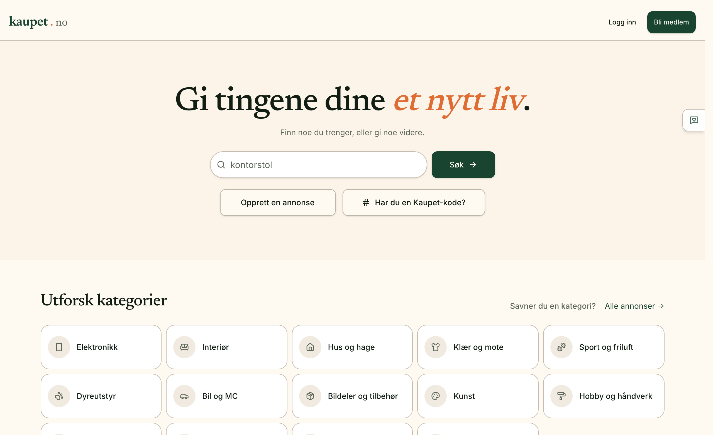
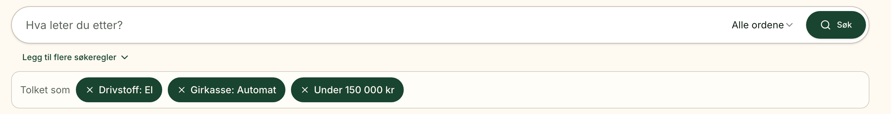
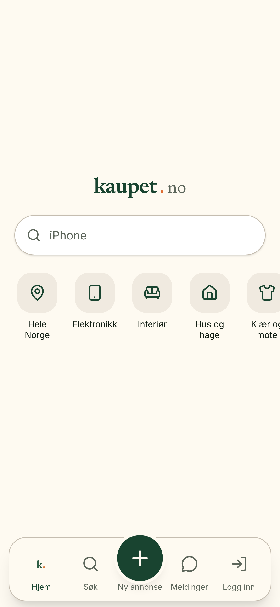

# Kaupet.no

[](LICENSE)
[](https://github.com/Kaupet-no/Kaupet/actions/workflows/ci.yml)
[](https://ko-fi.com/sprudlevann)

**Kjøp og selg brukt: gratis, uten sporing og med åpen kildekode.**

På [Kaupet.no](https://kaupet.no) koster det ingenting å legge ut en annonse. Vi selger ingen data, og all koden som kjører i produksjon ligger i dette repoet. Kaupet finnes på nett og som app for iOS og Android.



## Hvorfor Kaupet?

En markedsplass for brukte ting er grunnleggende infrastruktur. Den bør være gratis og åpen, og den bør ikke tjene penger på brukernes data.

- **Gratis å legge ut annonser, alltid.** Finansiering av tjenesten skal skje gjennom tilleggstjenester som gir merverdi. Aldri av basisfunksjonalitet som å legge ut annonser.
- **Ingen sporing.** Kaupet bruker ingen tredjeparts analyseverktøy eller sporende informasjonskapsler, og det lagres ingen adferdsdata. Det som ikke samles inn, kan ikke lekke eller selges. Se [personvernerklæringen](https://kaupet.no/personvern) og [behandlingsprotokollen](docs/PERSONVERN-BEHANDLINGSPROTOKOLL.md).
- **Åpen kildekode under [AGPL-3.0](LICENSE).** Forbedringer kommer alle til gode, uten unntak.

Finansiering av Kaupet skjer gjennom frivillig betalt synlighet for annonser og på Proff-abonnement for bedrifter som ønsker utvidet funksjonalitet som API og MCP-grensesnitt og branding på egne annonser. Det er aldri en forutsetning for å bruke tjenesten som markedsplass for Kjøp og Salg.

## Hva du kan gjøre

### Søk med vanlige ord

Skriv for eksempel `elbil automat under 150000 kr` i søkefeltet og Kaupet gjør om ordene til konkrete filtre. Hver tolkning vises som en egen filterbrikke.



Søket forstår synonymer (`4x4`, `hengerfeste`) og tall med enhet (`over 100 hk`). Det fjerner treff med `unntatt` (`sykkel unntatt elsykkel`) og foreslår kategorier og bilmerker. I tillegg har du filterpanel, kart og stedssøk med radius. Lagrede søk gir **varsel når nye annonser dukker opp**. Finner du ikke det du leter etter, kan du legge ut en **ønskes kjøpt**-annonse. Selgere som oppretter en annonse som passer, får beskjed.

### Lag en annonse på under ett minutt

- **Tittelen velger kategori for deg.** Forslaget kommer fra annonsehistorikken, og ellers fra en språkmodell. Kategorien styrer hvilke felter du blir spurt om: rammestørrelse for sykler, mål for bokhyller.
- **Regnummer → ferdig bilannonse.** Kaupet henter merke, modell, motor, utstyr og frist for EU-kontroll fra Statens vegvesen. Alt kan overstyres.
- **360°-opptak med mobilen.** Gå rundt kjøretøyet med Kaupet-appen for å opprette en 360°-visning av kjøretøyet. Potensielle kjøperne kan snurre bilen rundt i annonsen.
- Utkast lagres automatisk, bildene komprimeres før opplasting, og du bestemmer selv hvor presist lokasjon skal vises.

### Meldinger, vurderinger og Kaupet-kode

Hver annonse får sin egen samtale, med push-varsler, lest-status på tvers av enheter, blokkering og rapportering. Etter handelen kan kjøper og selger gi hverandre en vurdering. Hver annonse har også en **Kaupet-kode**, en kort kode som er lett å lese opp på telefon eller skrive på en lapp.

### App for iOS og Android



Appen deler kode med nettsiden, men har sin egen native layout. Den har bunnavigasjon, kamera, push-varsler, haptikk og systemets tilbakenavigasjon. Appen er tilgjengelig i App Store og Google Play. Preview-bygg for Android ligger under [Releases](https://github.com/Kaupet-no/Kaupet/releases). Se [README-CAPACITOR.md](README-CAPACITOR.md) for beskrivelse av hvordan du kan bygge appen selv.

### Kaupet Proff for bedrifter

Bedrifter får et eget bedriftskonsoll med flere lokasjoner, medlemmer, egen profil på annonsene og enkel statistikk. For bedrifter som ønsker utvidet funksjonalitet, er det mulig å abonnere på Kaupet Proff, som blant annet gir mulighet til å opprette og synksronisere annonser maskinelt:

- **Excel/CSV-import** av flere annonser på én gang
- **REST-API** basert på OpenAPI-spesifikasjon (`/api/v1/openapi.json`)
- **MCP-server**, for å la KI-assistenter administrere annonser direkte

Se [docs/PROFF-API.md](docs/PROFF-API.md) for dokumentasjon.

Kaupet Proff er en frivillig, betalt tjeneste, og er ingen forutsetning for å kunne benytte Kaupets øvrige funksjoner. Det skal være gratis å opprette annonser på Kaupet, også for bedrifter.

## Kjør Kaupet lokalt

```bash
git clone https://github.com/Kaupet-no/Kaupet.git
cd Kaupet
bun install
bun dev
```

Appen kjører på `http://localhost:8080`. For fullt oppsett med Supabase i Docker, staging-data og eksterne prosjekter, se [README-LOKALT.md](README-LOKALT.md).

## Teknologi

[TanStack Start](https://tanstack.com/start) (React 19, SSR) · [Tailwind CSS v4](https://tailwindcss.com) · [shadcn/ui](https://ui.shadcn.com) · [Supabase](https://supabase.com) · [Cloudflare Workers, R2 og Turnstile](https://www.cloudflare.com) · [Capacitor](https://capacitorjs.com)

Integrasjoner: [Statens vegvesen](https://www.vegvesen.no/om-oss/om-organisasjonen/apne-data/) (kjøretøyoppslag), [Mistral](https://mistral.ai) (kategoriforslag), [Vipps/MobilePay](https://vipps.no) (betaling), Kartverket og OpenStreetMap (kart og sted). Alle kall til tredjeparter skjer på server-nivå. Se [docs/ARCHITECTURE.md](docs/ARCHITECTURE.md).

## Bidra

Vi tar gjerne imot bidrag, både store og små. Start med [CONTRIBUTING.md](CONTRIBUTING.md) og [CODE_OF_CONDUCT.md](CODE_OF_CONDUCT.md).

- `bun run test` kjører enhetstestene. [docs/STAGING.md](docs/STAGING.md) beskriver e2e- og RLS-tester og staging-miljøet, og [docs/TESTSTRATEGI.md](docs/TESTSTRATEGI.md) beskriver teststrategien.
- Ingenting testes i produksjon. Push til `staging`-branchen for å teste på **https://staging.kaupet.no**.

Har du funnet en sårbarhet? Følg [SECURITY.md](SECURITY.md), og ikke opprett en offentlig issue.

## Lisens

[GNU Affero General Public License v3.0](LICENSE). Endrer eller videreutvikler du koden, må du dele den tilbake under samme vilkår. Det gjelder også når du kjører den som en tjeneste (SaaS). Se [NOTICE](NOTICE).

---

<sub>_Kaupet_ er en bøyd form for det norrøne ordet _Kaup_ som betyr _kjøp_ eller _avtale_.</sub>
